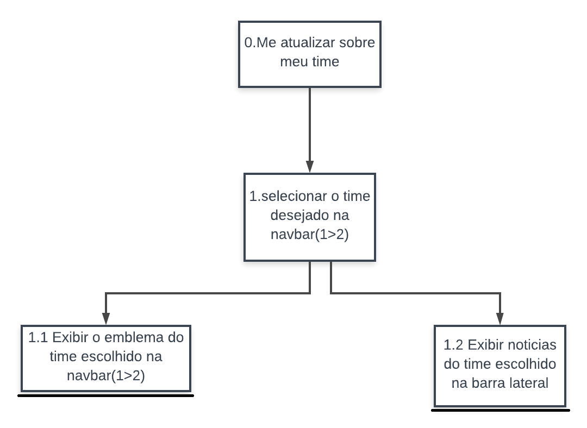
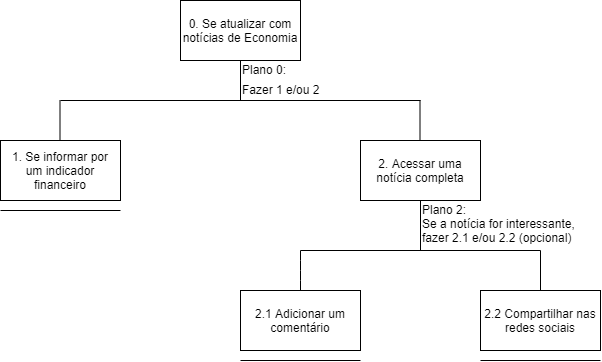

&emsp;
A Análise Hierárquica de Tarefas ( HTA – Hierarchical Task Analysis) foi desenvolvida na década de 1960 para entender as competências e habilidades exibidas em tarefas complexas e não repetitivas, bem como para auxiliar na identificação de problemas de desempenho (Annett, 2003; Annett e Duncan, 1967). Ela ajuda a relacionar o que as pessoas fazem (ou se recomenda que façam), por que o fazem, e quais as consequências caso não o façam corretamente. Ela se baseia em psicologia funcional, e não comportamental, como eram as abordagens da época em que foi criada.

| Objetivos/Operações                                    | Problemas e Recomendações                                                                                                                                                                                                                                                          |
| ------------------------------------------------------ | ---------------------------------------------------------------------------------------------------------------------------------------------------------------------------------------------------------------------------------------------------------------------------------- |
| 0. Me atualizar sobre meu time 1>2                     | **Input** : Opção na navbar superior que permite selecionar o time de preferência para receber notícias e atualizações.  **Plano**:  Selecionar o time de preferência  e depois exibir o emblema do time no menu superior.                                                         |
| 1. Selecionar o time desejado na navbar                | **Feedback**:  O emblema do time escolhido passa a ser exibido no canto superior direito, na navbar, sendo este um link que quando clicado abre uma barra lateral com as notícias.  **Plano**:  Ser notificado a respeito das notícias mais recentes sobre seu time de preferência |
| 1.1  Exibir emblema do time escolhido na navbar        | **Ação**:  O time escolhido deve permanecer sendo exibido no canto superior direito da tela, junto ao navbar.   **Recomendação**:  O emblema deve funcionar como um link que ao clicado exibe uma barra lateral com as últimas notícias do time                                    |
| 1.2 Exibir notícias do time escolhido na barra lateral |                                                                                                                                                                                                                                                                                    |

| Objetivos/Operações                         | Problemas e Recomendações                                                                                                                                                        |
| ------------------------------------------- | -------------------------------------------------------------------------------------------------------------------------------------------------------------------------------- |
| 0. Se atualizar com notícias de Economia    | **Input**:  Selecionar no menu o tipo de notícia que será mostrado, Economia.                                                                                                    |
| 1. Selecionar categoria (economia)          | **Plano**:  Selecionar no menu o tipo de notícia que será mostrado, Economia.  **Feedback**:  Uma lista de notícias sobre economia e várias tabelas de “Indicadores Financeiros” |
| 1.1 Se informar por um indicador financeiro | **Plano**:  O usuário pode se informar diretamente por um Indicador Financeiro, sem necessariamente abrir uma notícia completa                                                   |
| 1.2 Selecionar uma noticia                  | **Input**:  O usuário pode acessar uma notícia completa a partir do seu título e imagem.  **Feedback**:  A notícia completa é aberta                                             |
| 1.2.1. Adicionar um comentário              | **Input**:  O usuário pode adicionar um comentário na notícia                                                                                                                    |
| 1.2.2. Compartilhar nas redes sociais       | **Input**:  O usuário pode compartilhar a notícia em suas redes sociais                                                                                                          |

### **Histórico de Revisões**

| Data       | Responsável                                       | Versão | Alteração                                                               |
| ---------- | ------------------------------------------------- | ------ | ----------------------------------------------------------------------- |
| 17/10/2019 | [@lbrunofidelis](http://github.com/lbrunofidelis) | 1.0    | Adicionando documento                                                   |
| 5/11/2019  | [@lucasqmc](http://github.com/lucasqmc)           | 2.0    | Adicionando mudanças na analise de tarefas, fluxo da categoria economia |