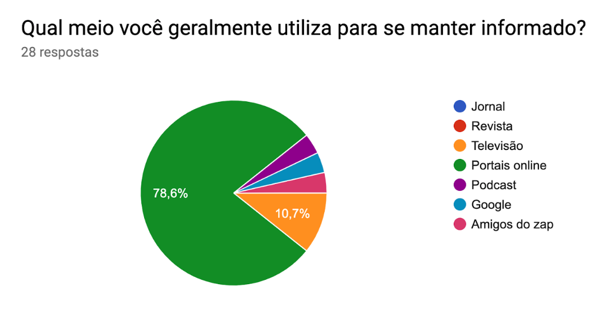
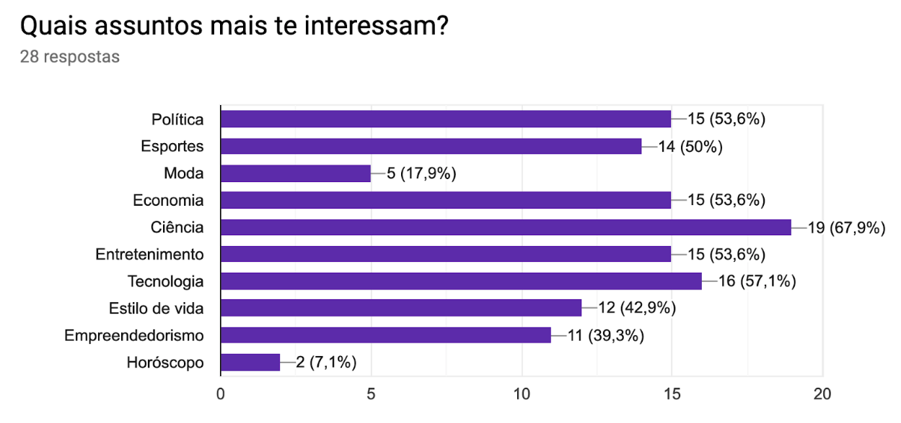
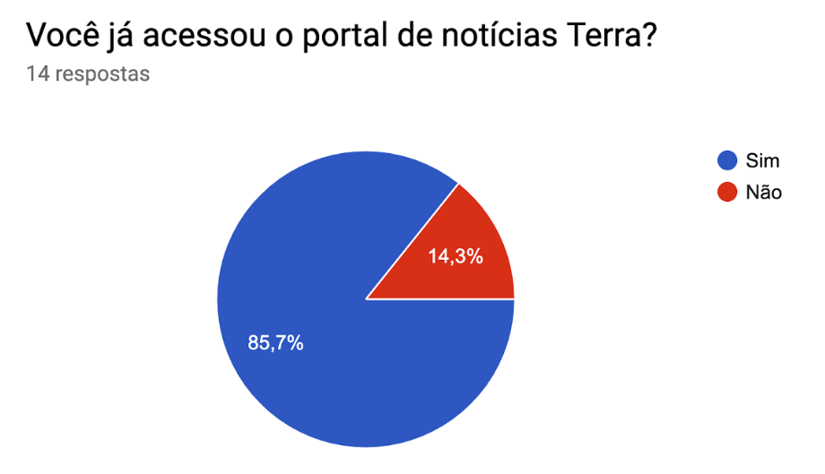
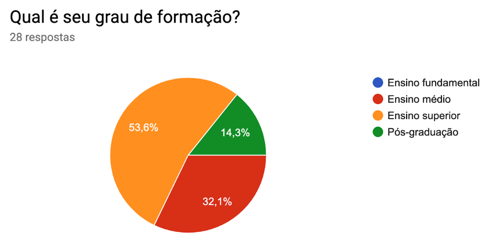
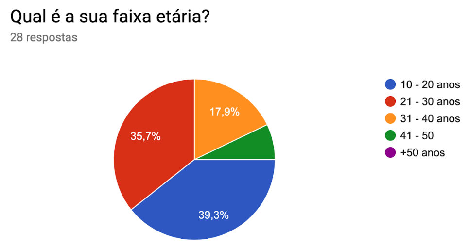
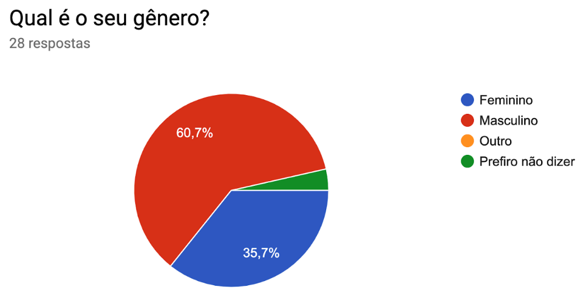
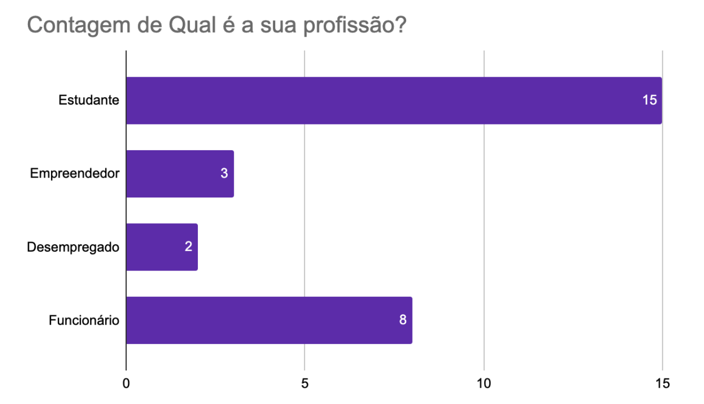

## Análise de usuário

&emsp;
O Perfil de usuário é uma descrição detalhada das características a respeito dos usuários, para sua elaboração é necessário identificar as características de interesse (cargo, função, experiência, nível de instrução, atividades principais, faixa etária etc.) e conduzir um estudo (através de entrevistas e questionários) para coletar os dados dos usuários. Partindo dos dados coletados, agregamos os valores em grupos e faixas nos quais os usuários se encaixam e dessa maneira traçamos os perfis de usuários com características semelhantes e calculamos a proporção de usuários que se encaixam em cada perfil. Em geral, um perfil de usuário é caracterizado por dados sobre o próprio usuário, dados sobre sua relação com tecnologia, sobre seu conhecimento do domínio do produto e das tarefas que deverá realizar utilizando o produto.
As características de um perfil de usuário são priorizadas conforme  o produto e projeto em questão. Sendo assim, a maior parte dos recursos para capturar informações deve ser destinada a essas características-chave do seu produto.
Foi realizado um questionário com conhecidos dos membros do grupo de diferentes faixas etárias, de modo que a pontuação final representa uma média das respostas.

## Questionário

## Perfil do usuário

&emsp;
Ao analisarmos nossa pesquisa podemos perceber uma preferência geral por notícias em portais na internet em quase todas as faixas etárias, empregos e assuntos. Por se tratar de um de um grande aglomerado de informações de várias áreas, o Portal Terra acaba se tornando um espaço perfeito para qualquer pessoa se informar sobre sua área de interesse. Dessa forma o perfil final do usuário para o Portal Terra é uma pessoa que quer se informar e prefere fazer isso pela internet, sem distinção de idade ou gênero.

### Interesse por faixa etária

#### 10 - 20 anos
<ul> 
    <li style="margin-bottom: 0px">Ciência;</li> 
    <li style="margin-bottom: 0px">Entreterimento;</li> 
    <li style="margin-bottom: 0px">Tecnologia;</li> 
    <li style="margin-bottom: 0px">Estilo de vida.</li> 
</ul>

#### 21 - 30 anos
<ul> 
    <li style="margin-bottom: 0px">Empreendedorismo;</li> 
    <li style="margin-bottom: 0px">Tecnologia;</li> 
    <li style="margin-bottom: 0px">Política;</li> 
    <li style="margin-bottom: 0px">Esportes;</li> 
    <li style="margin-bottom: 0px">Economia.</li> 
</ul>

#### 31 - 40 anos
<ul> 
    <li style="margin-bottom: 0px">Ciência;</li> 
    <li style="margin-bottom: 0px">Entreterimento;</li> 
    <li style="margin-bottom: 0px">Política;</li> 
    <li style="margin-bottom: 0px">Esportes;</li> 
    <li style="margin-bottom: 0px">Tecnologia;</li> 
    <li style="margin-bottom: 0px">Estilo de vida.</li> 
</ul>

#### 41 - 50 anos
<ul> 
    <li style="margin-bottom: 0px">Ciência;</li> 
    <li style="margin-bottom: 0px">Esportes;</li> 
    <li style="margin-bottom: 0px">Moda;</li> 
    <li style="margin-bottom: 0px">Estilo de vida.</li> 
</ul>

## **Referência**
* 
 SIMONE DINIZ JUNQUEIRO BARBOSA, BRUNO SANTANA DA SILVA, Interação Humano-Computador, 1a . Edição, Editora Campus, 2010.

* 
CAVALCANTI, Jorge. Engenharia de Usabilidade. [S. l.], [21--]. Disponível em: http://www.univasf.edu.br/~jorge.cavalcanti/Ihm5_Engenharia%20de%20Usabilidade.pdf. Acesso em: 3 nov. 2019.

## **Histórico de Revisões**

| Data       | Responsável                                       | Versão | Alteração             |
| ---------- | ------------------------------------------------- | ------ | --------------------- |
| 17/10/2019 | [@tmcstiago](http://github.com/tmcstiago) e [@medeiroslucas](http://github.com/medeiroslucas) | 1.0 | Adicionando o questionário |