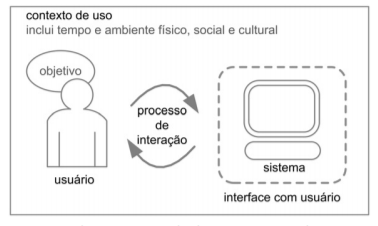

## **Contexto de Uso**

&emsp;Devem ser O contexto de uso influencia a interação de pessoas com sistemas interativos, pois elas estão inseridas em determinada cultura, sociedade e organização, possuem modo próprio de realizar suas atividades, possuem conhecimentos e concepções próprios e utilizam linguagem para interagir com as outras pessoas. É importante estarmos cientes de que o contexto de uso costuma ser diferente do contexto em que os desenvolvedores estão inseridos e com o qual estão acostumados. Daí a importância de investigarmos o contexto de uso com foco nos usuários e sob o seu ponto de vista. Isso nos permite avaliar o impacto dos diferentes aspectos do contexto sobre a interação humano-computador sendo concebida ou avaliada.

&emsp;O contexto de uso é caracterizado por toda situação do usuário relevante para a sua interação com o sistema (Dey, 2001), incluindo o momento de utilização do sistema (quando) e o ambiente físico, social e cultural em que ocorre a interação (onde). A Figura abaixo ilustra uma situação típica de uso: um usuário engajado num processo de interação com a interface de um sistema interativo, buscando alcançar um objetivo em determinado contexto de uso. O contexto de uso é caracterizado por toda situação do usuário relevante para a sua interação com o sistema (Dey, 2001), incluindo o momento de utilização do sistema (quando) e o ambiente físico, social e cultural em que ocorre a interação (onde).

<i>Elementos envolvidos no processo de interação</i>

O exemplo a seguir examina esses elementos através de um cenário de uso:

<i>Exemplo – Elementos envolvidos no processo de interação</i>

<b>Contexto de uso:</b> Conforto do lar, tempo livre, horários de trabalho

<b>Usuário:</b> Marcelo Pereira
<b>Sistema:</b> Terra

<b>Objetivo:</b> se manter informado com as mais variadas notícias, sempre atualizadas

<b>Processo de interação:</b>ele visualiza uma notícia, clica sobre a mesma, lê. Feito isso, ele pode ler ou não mais notícias.

## **Referência**
* 
 SIMONE DINIZ JUNQUEIRO BARBOSA, BRUNO SANTANA DA SILVA, Interação Humano-Computador, 1a . Edição, Editora Campus, 2010.

* 
CAVALCANTI, Jorge. Engenharia de Usabilidade. [S. l.], [21--]. Disponível em: http://www.univasf.edu.br/~jorge.cavalcanti/Ihm5_Engenharia%20de%20Usabilidade.pdf. Acesso em: 3 nov. 2019.

## **Histórico de Revisões**

Data | Responsável | Versão | Alteração 
---- | ----------- | ------ | ---------
03/11/2019 | [@dansousamelo](http://github.com/dansousamelo) | 1.0 | Adicionando Contexto de Uso|