## **Avaliação Heurística**
De posse das heurísticas de Jakob Nielsen, o site terra.com.br, um site principalmente
de notícias, foi escolhido devido a problemas de usabilidade, destrinchando e analisando as
heurísticas de uma a uma:

1. Visibilidade de qual estado estamos no sistema

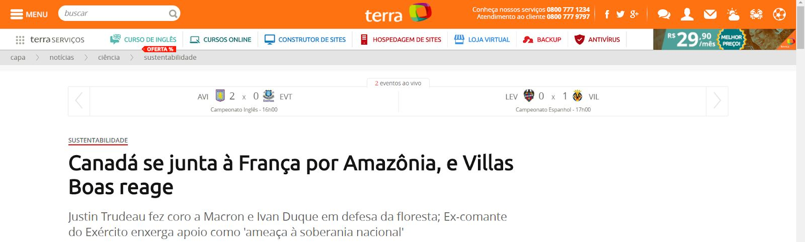

Quando clicamos em uma notícia, por exemplo, sobre sustentabilidade, o sistema
mostra para gente um feedback do tipo de notícia apresentada.

2. Compatibilidade do sistema com o mundo real

O usuário consegue se lembrar de algo semelhante ao mundo físico, como os ícones
acima.

3. Controle do usuário e liberdade

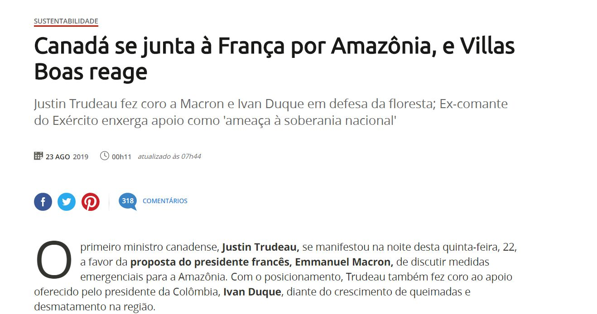

Se desejarmos compartilhar a notícia devemos adivinhar onde clicar para
compartilhá-la, confundindo o usuário.

Tabela 1: Formulário para Avaliação Heurística – Controle e liberdade

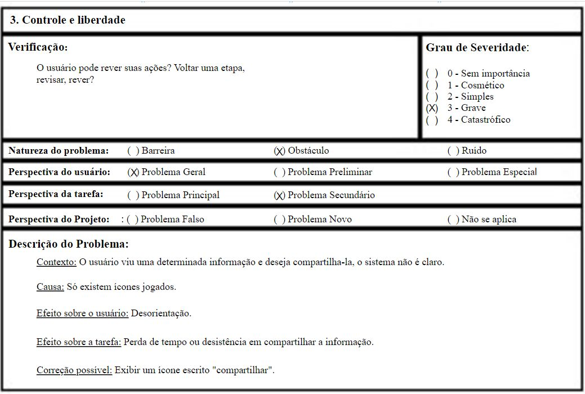

4. Consistência

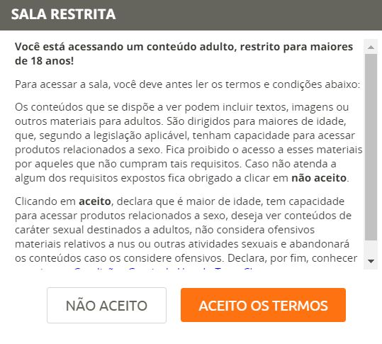

O site apresenta uma identidade visual como por exemplo, existe uma aba de bate
papo, para entrar deve-se aceitar os termos de usos. Existe uma distinção de cores, a cor
laranja é predominante no sistema analisado.

5. Prevenção de erros

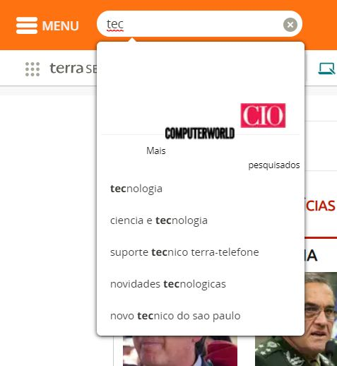

Ao buscar algum assunto no site, o mesmo sugere termos correspondentes,
auxiliando o usuário, evitando erros.

6. Reconhecimento ao invés de recordação

Tabela 2: Formulário para Avaliação Heurística – Reconhecimento ao invés de recordação
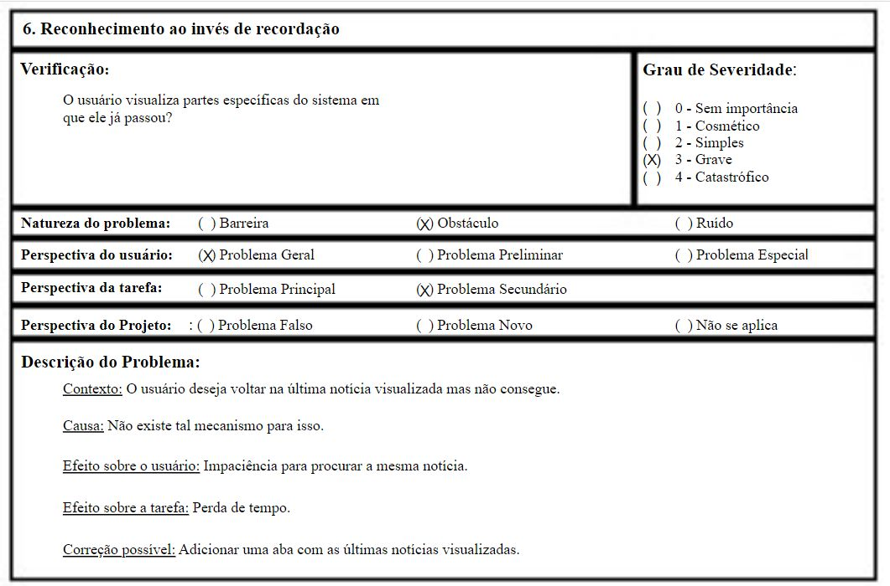

7. Flexibilidade e eficiência de uso

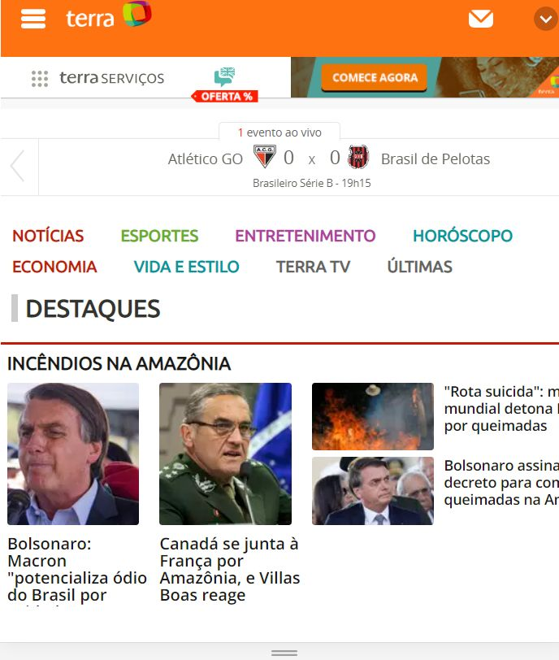

O site possui responsividade, atendendo assim a outras plataformas.

8. Estética e Design Minimalista

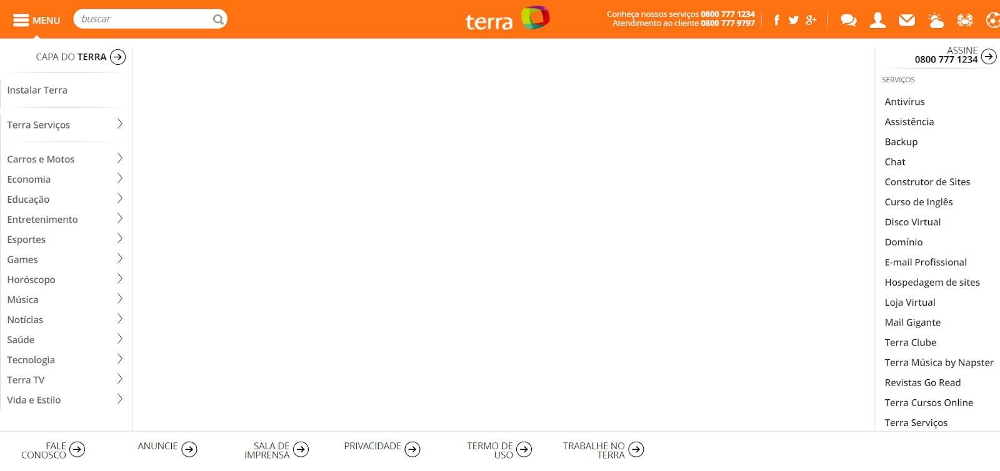

O menu de navegação do sistema é bastante confuso, além de uma tela branca sem
nada ao fundo, ao lado direito possui outra distração para o usuário navegar no mecanismo de
menu.

Tabela 3: Formulário para Avaliação Heurística – Design Minimalista
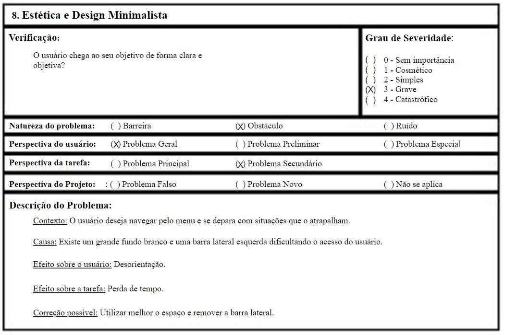

9. Ajuda aos usuários no reconhecimento, diagnóstico e correção de erros

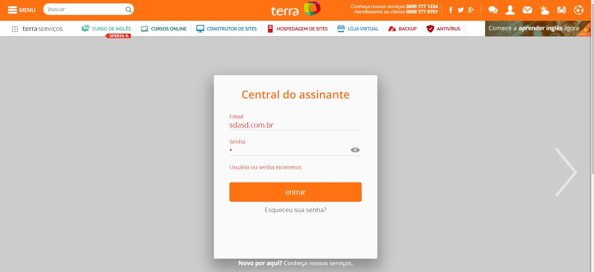

O sistema possui um controle para registrar um usuário, deve-se preencher
informações corretas.

10. Ajuda e Documentação

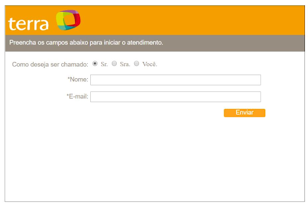

O único meio de pedir ajuda é via email, bate papo e pelo twitter, mas seria útil uma
aba com perguntas frequentes.

Tabela 4: Formulário para Avaliação Heurística – Ajuda e Documentação

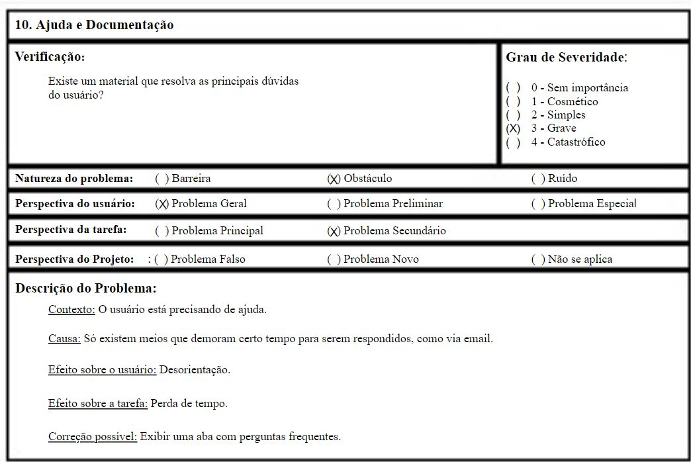

### **Histórico de Revisões**

Data | Responsável | Versão | Alteração 
---- | ----------- | ------ | ---------
13/10/2019 | [@pedroMiranda7410](http://github.com/pedroMiranda7410) | 1.0 | Adicionando Versão Antiga |