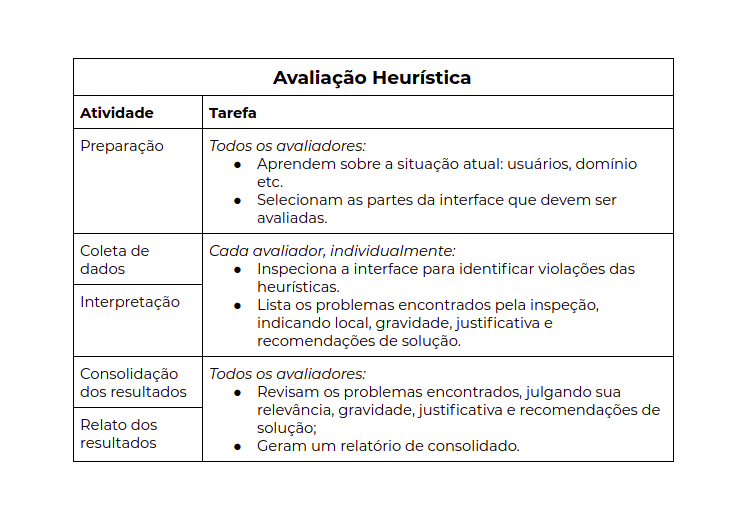
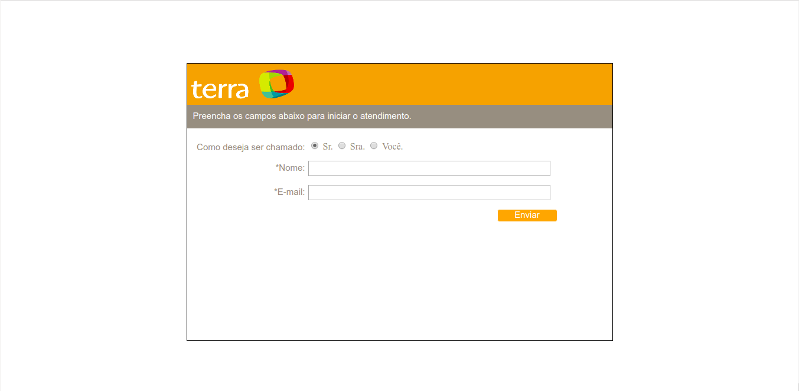

## **Avaliação Heurística 2.0**

A avaliação heurística é um método de avaliação de IHC criado para encontrar problemas de usabilidade durante um processo de design interativo (Nielsen e Molich, 1990; Nielsen, 1993; Nielsen, 1994a). 

Esse método de avaliação orienta os avaliadores a inspecionar sistematicamente a interface em busca de problemas que prejudiquem a usabilidade. Por ser um método de inspeção, a avaliação heurística foi proposta como uma alternativa de avaliação rápida e de baixo custo, quando comparada a métodos empíricos.

### **Objetivo**

Tal avaliação, tem como objetivo inspecionar sistematicamente a interface, entre as páginas do site www.terra.com.br, em busca de problemas,  que prejudiquem a usabilidade, voltados para usuários com um perfil de pessoa adulta que possui pretensões de se atualizarem quanto ao mundo das notícias e esportes, por exemplo.

### **Escopo**

Como estruturação de atividades a serem seguidas, adotamos o seguinte modelo de avaliação heurística, que é proposta por Nielsen:

### **Diretrizes utilizadas**
<ul>
    <li>Inspecionamos apenas conteúdos que estavam inseridos, especificamente, no site www.terra.com e nenhum portal relacionado à ele. </li>
    <li>Utilizamos como tópicos de avaliação os métodos empíricos propostos por Nielsen, que são eles:</li>
    <ul style="list-style-type: circle;">
        <li>visibilidade do estado do sistema;</li>
        <li>correspondência entre o sistema e o mundo real;</li>
        <li>controle e liberdade do usuário;</li>
        <li>consistência e padronização;</li>
        <li>reconhecimento em vez de memorização;</li>
        <li>flexibilidade e eficiência de uso;</li>
        <li>projeto estético e minimalista;</li>
        <li>prevenção de erros;</li>
        <li>ajude os usuários a reconhecerem, diagnosticarem e se recuperarem de erros;</li>
        <li>ajuda e documentação;</li>
    </ul>
</ul>

### **Avaliadores**
1. Pedro Henrique Queiroz Miranda
2. Daniel Souza de Melo

### **Problemas encontrados **

<li><i><u>A funcionalidade “Modo Noturno”</u></i></li>

  1. <b>local onde ocorre:</b> 

Dentro da aba Painel do usuário/configurações, existe uma checkbox para ligar e desligar o modo noturno para o usuário.

  2. <b>descrição do problema: </b>

Ao ligar a opção de modo noturno, o conteúdo das páginas passam de branco para preto, porém a barra de navegação, a aba de menu e até mesmo o próprio painel do usuário se mantém no branco, deixando de seguir o padrão da funcionalidade.

  3. <b>diretriz(es) violada(s):</b>
     * consistência e padronização;
  4. <b>severidade do problema:</b> Baixo
  5. <b>sugestões de solução: </b>
     * Realizar a manutenção de todas as partes que não se adequam ao modo noturno;
     * Retirar o modo noturno;

<li><i><u>Atendimento ao Cliente via Chat</u></i></li>
  1. <b>local onde ocorre:</b>
			
Ao clicar no link “atendimento”, localizado na barra de navegação do topo, você é redirecionado para a página de atendimento, então logo abaixo do conteúdo inicial ele te disponibiliza 4 opções de atendimentos e uma delas é o chat.

  2. <b>descrição do problema:</b>

Ao clicar na opção chat, você é redirecionado para uma página totalmente despadronizada sem nenhum botão para voltar ou ir para outro link: 

	
  3. <b>diretriz(es) violada(s):</b>
     * controle e liberdade do usuário;
     * consistência e padronização;
     * prevenção de erros;
  3. <b>severidade do problema:</b> Baixo
  4. <b>sugestões de solução:</b>
     * Manter o padrão seguido pelas demais páginas do site;

<li><i><u>Disposição de notícias</u></i></li>

  1. <b>local onde ocorre:</b> 
Página inicial ou demais páginas que envolvam dispor notícias de categorias específicas.

  2. <b>descrição do problema:</b> 
As notícias são jogadas dentro das páginas de forma aleatória e por conter muitos anúncios, dentro do site, traz muita confusão em tentar identificar o que é anúncio de publicidade e notícia. 

  3. <b>diretriz(es) violada(s):</b> 
     * consistência e padronização;
     * projeto estético e minimalista;
  4. <b>severidade do problema:</b>  Média
  5. <b>sugestões de solução:</b>  
     * Diminuir ou retirar os anúncios que são, praticamente, despejados de forma incoerente e inesperado;
     * Organizar a disposição de notícias; 

<li><i><u>Página que não segue padrão de formato relacionado a todas as outras páginas</u></i></li>
  1. <b>local onde ocorre:</b> (https://www.terra.com.br/noticias/brasil/catve/videos)
  2. <b>descrição do problema:</b>

A página não segue o padrão de disposição de conteúdo: 

     * Não contendo título informando do que se trata a página;
     * Não mostra em que página você está situado;
     * Não dispõe o tipo do conteúdo que está sendo mostrado.
  2. <b>diretriz(es) violada(s):</b>
     * prevenção de erros;
     * reconhecimento em vez de memorização;
     * consistência e padronização;
  2. <b>severidade do problema:</b> Média
  2. <b>sugestões de solução:</b>
     * Trazer a padronização para esta página.

### **Histórico de Revisões**

Data | Responsável | Versão | Alteração 
---- | ----------- | ------ | ---------
14/10/2019 | [@pedroMiranda7410](http://github.com/pedroMiranda7410) | 1.0 | Adicionando Versão 2.0 de Avaliação Heurística |