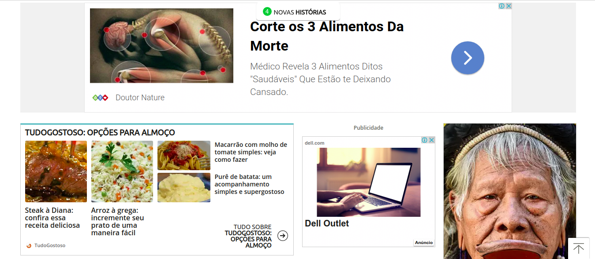

## **Grupo de Foco**

Grupo de pessoas colocadas juntas para discutir um determinado assunto.
Essa discussão pode envolver a experiência dos usuários com um produto em particular, os requisitos para um novo produto ou problemas de usabilidade associados ao uso do produto.

É um tipo especial de grupo em termos de objetivo, tamanho, composição e procedimentos. O propósito do grupo de foco é ouvir e obter informação, e é uma maneira de saber melhor como as pessoas se sentem e pensam em relação a um assunto, produto ou serviço.

Os participantes são selecionados por terem certas características em comum que os relaciona ao assunto do grupo.

 

<b>Tem como objetivo:</b> avaliar atitudes, opiniões e impressões dos usuários

<b>Vantagens: </b>

* permite coletar informações de muitos usuários simultaneamente (em grupo);
* discussão em grupo com frequência dispara novas ideias.

<b>Esforço:</b>

* recrutar usuários suficientes pode requerer muitos recursos

Em um grupo de foco, diversas pessoas (geralmente entre três e dez) são reunidas por uma ou duas horas numa espécie de discussão ou entrevista coletiva, guiada por um moderador experiente. Quando são bem conduzidos, os grupos de foco podem fornecer uma ampla gama de informações num curto período de tempo. Grupos de foco permitem coletar informações sobre um público-alvo sobre quem tenhamos pouca informação. Podem ser realizados para gerar ideias; obter opiniões de pessoas sobre tópicos, conceitos ou demonstrações; obter respostas a uma série de questões; identificar conflitos relacionados a terminologias; identificar expectativas de diferentes grupos de pessoas; e descobrir problemas, desafios, frustrações, atitudes, preferências e aversões que surgem apenas num contexto social e por isso podem ser ignoradas por outras técnicas (Lazar et al., 2010; Sharp et al., 2007; Courage e Baxter, 2005). Os grupos de foco têm como vantagem permitir obter, em pouco tempo, múltiplos pontos de vista de um grupo de pessoas. O papel do moderador de um grupo de foco é muito importante para assegurar que pessoas mais quietas ou tímidas participem e evitar que as extrovertidas e agressivas dominem a discussão. Courage e Baxter (2005) sugerem evitar pedir para os participantes fazerem previsões sobre algo que eles ainda não experimentaram, como, por exemplo, pedir para avaliar a utilidade de algo que ainda não utilizaram. Além disso, devemos evitar endereçar tópicos polêmicos, relacionados, por exemplo, com política e valores morais. Algumas questões típicas exploradas em grupo de foco são (Courage e Baxter, 2005): 

* um “dia típico” de um usuário ou o dia de trabalho mais recente;
* as tarefas que os usuários realizam e como eles as realizam; 
* o domínio em geral (e.g., terminologia, procedimentos normatizados); 
* preferências e aversões dos usuários; 
* resultados desejados ou objetivos dos usuários; 
* reações, opiniões ou atitudes dos usuários sobre um determinado produto ou conceito; 
* resultados desejados para novos produtos ou funcionalidades. 

Além de perguntas, é comum fornecer aos participantes materiais concretos e protótipos do produto para que eles tenham um foco bem definido sobre o que falar. No caso de protótipos, podemos também pedir para eles realizarem algumas tarefas e relatarem suas experiências. 

### **Roteiro ( 1 ) - Grupo Focal**

### **Objetivos**
* Constatar a perspectiva de usuários adultos quanto a desconfortos visuais na plataforma;
* Constatar se a plataforma traz conteúdo relevante;

### **Temas:** Usabilidade, Bugs.

### **<u>Seção 1</u>** - Usuários adultos que procuram estar sempre atualizados quanto a notícias e conteúdos em geral.

<i><u>Questão-chave 1</i></u> - O site terra sacia a necessidade de se atualizar dos acontecimentos do mundo com seus conteúdos noticiários e outros?

* Eles estão sempre postando notícias atualizadas?
* As notícias são relevantes?

    * <u>Discussão entre Integrantes:</u>
        * <i>Integrante 1:</i>
A plataforma está sempre atualizada e me traz muitas informações relevantes, principalmente quando se fala de política. 

        * <i>Integrante 2:</i>
Não entro na plataforma com frequência, mas nos momentos em que abro a página inicial vejo sempre notícias atualizadas e de diversos assuntos, desde que tenham sido relevantes na mídia. 

<i><u>Questão-chave 2</i></u> - Tendo como base, por exemplo, essa imagem abaixo. É fácil e intuitivo saber o que é notícia e publicidade?

* <u>Discussão entre Integrantes:</u>
    * <i>Integrante 1:</i>
Conseguiu, rapidamente, distinguir a diferença entre o que é notícia e o que é publicidade. 

    * <i>Integrante 2:</i>
Confundiu a publicidade de cima com uma notícia 

<i><u>Questão-chave 3</i></u> - A grande quantidade de publicidade entre as notícias, interfere visualmente e cognitivamente o uso da plataforma?

* <u>Discussão entre Integrantes:</u>
    * <i>Integrante 1:</i>
As publicidades são incrivelmente irritantes e sempre que aparecem fico com muita raiva. Quando se trata de publicidade em vídeo, eu desligo o som e olho para outro lugar, mas menos para a publicidade até o vídeo acabar. 

    * <i>Integrante 2:</i>
As publicidades me trazem um desconforto muito grande. É sempre chato estar lendo as notícias rápidas que aparece e ler uma publicidade achando que é notícia. 

### **Conclusão**

 Foram pegos 2 usuários adultos, sendo que 1 utiliza o terra com uma certa frequência e outro que tem um menor contato com a plataforma, porém tem conhecimento sobre tal.

 Seguindo os objetivos do grupos de foco, acima: "Constatar a perspectiva de usuários adultos quanto a desconfortos visuais na plataforma" e "Constatar se a plataforma traz conteúdo relevante", percebemos que a aplicação terra traz, em questão de conteúdo noticiário, uma excelente e atualizada bagagem, satisfazendo esses usuários. Quanto a desconfortos visuais, vemos que as publicidades geram irritação, confusão e uma certa raiva da plataforma.

### **Histórico de Revisões**

Data | Responsável | Versão | Alteração 
---- | ----------- | ------ | ---------
13/10/2019 | [@pedroMiranda7410](http://github.com/pedroMiranda7410) | 1.0 | Adicionando Grupo de Foco |
