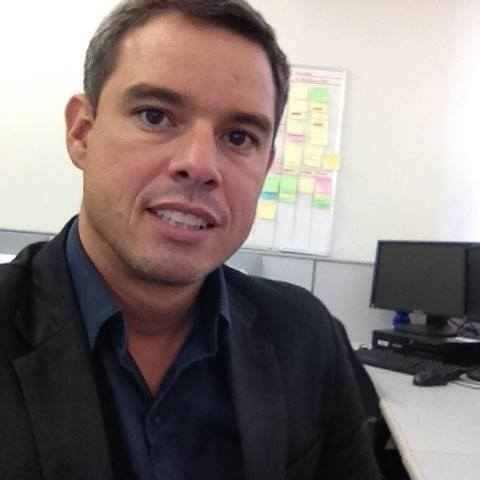

&emsp;
Uma persona é um personagem fictício, arquétipo hipotético de um grupo de usuários reais, criada para descrever um usuário típico (Cooper et al., 2007; Pruitt e Adlin,2006; Cooper, 1999). É utilizada principalmente para representar um grupo de usuários finais durante discussões de design, mantendo todos focados no mesmo alvo. As personas são definidas principalmente por seus objetivos, que são determinados num processo de refinamentos sucessivos durante a investigação inicial do domínio de atividade do usuário. Em geral, começamos com uma aproximação razoável e convergimos numa população plausível de personas.

### **Persona 1**       

**Nome:** Israel Ribeiro    
**Idade:** 31   
**Tipo:** Primária      
**Objetivos:** Se atualizar do cotidiano por meio de notícias       
**Habilidades:** Diretor comercial      
**Tarefas:** Administrar vendas     

&emsp;
    Israel Ribeiro, de 31 anos, trabalha como Diretor comercial de uma pequena empresa de soluções tecnológicas/desenvolvimento de sistemas. Israel cursou Marketing e Vendas após realizar alguns períodos em Análise e Desenvolvimento de Software e realizou a troca de curso quando abriu uma empresa com um grupo de amigos e desenvolveram diversos produtos, porém não tinham clientes. Israel se especializou na área de marketing e obteve um crescimento satisfatório da empresa.

### **Persona 2**       

**Nome:** Marcelo Pereira       
**Idade:** 39       
**Tipo:** Primária      
**Objetivos:** Se atualizar sobre as notícias do seu time       
**Habilidades:** Gerente de Tecnologia      
**Tarefas:** Gerenciar tarefas de desenvolvimento de software       

&emsp;
    Marcelo Pereira, de 39 anos, trabalha com Gerenciamento de equipe de desenvolvimento de software, no Ministério da Saúde. Marcelo fez ciência da computação e começou sua vida profissional fornecendo suporte e consertando máquinas na empresa onde trabalhava, aṕos adquirir mais experiência, Marcelo inicialmente direcionou seu foco para a área de desenvolvimento de software, onde logo percebeu que teria o perfil de gerente de projetos por ser confiante e sempre inspirar sua equipe de maneira a melhorar o desempenho e eficiência no trabalho de todos. 

&emsp;
	Para Marcelo, é essencial ser autodidata e sempre buscar o conhecimento por si próprio, sem precisar de terceiros sempre o auxiliando. O conhecimento prático para ele é essencial na sua área, sendo de extrema importância a prática real para se adequar aos diferente tipos de problema de forma rápida e eficiente. No seu campo de atuação é necessário ter o perfil de líder que inspira e estimula sua equipe, dando muito valor às relações interpessoais e a habilidade de se comunicar de forma clara.

### **Histórico de Revisões**

| Data       | Responsável                                       | Versão | Alteração             |
| ---------- | ------------------------------------------------- | ------ | --------------------- |
| 17/10/2019 | [@lbrunofidelis](http://github.com/lbrunofidelis) | 1.0    | Adicionando documento |