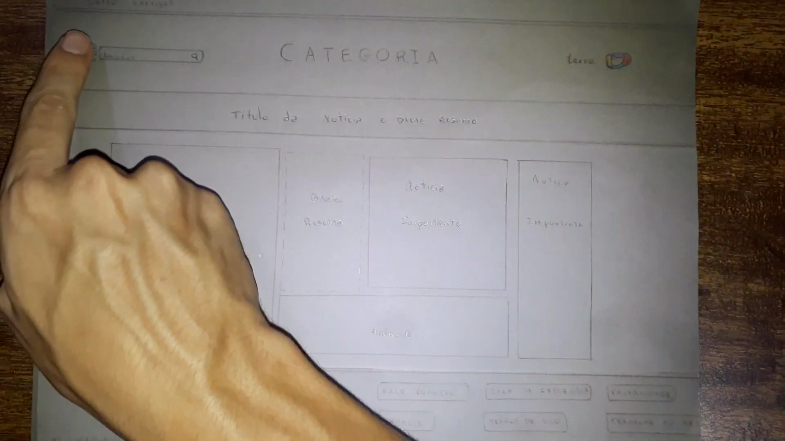
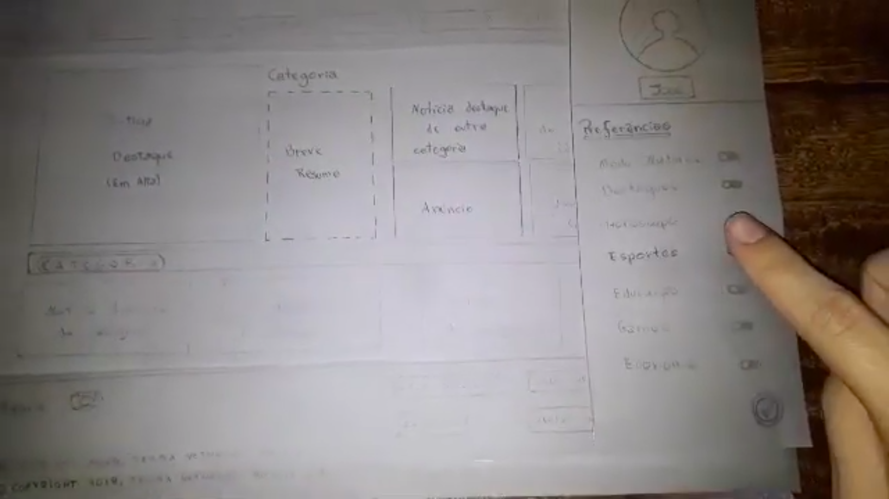
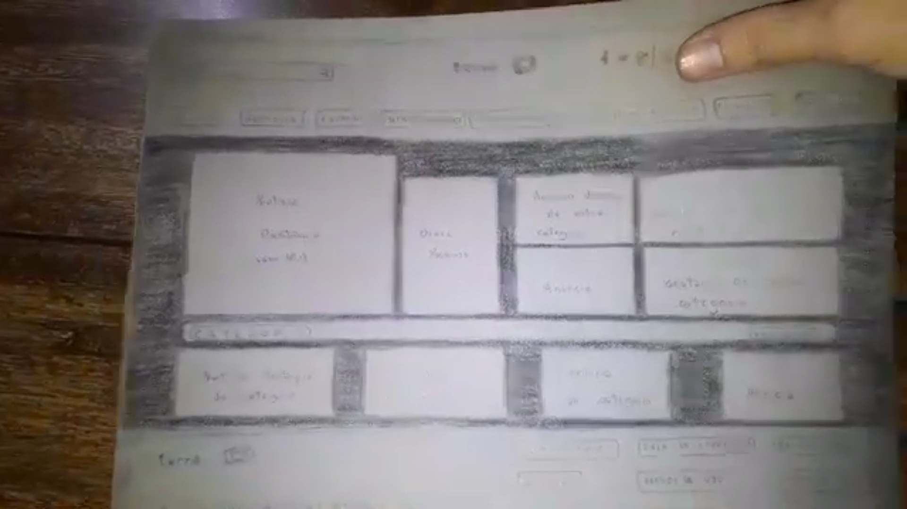

### **Objetivos**
* 

    Identificação de problemas que afetem a experiência de usuário.

* 

    Interação rápida e de baixo custo.

### **Objetos**

    Os objetos de avaliação da Prototipagem de papel são: as folhas do protótipo e/ou os vídeos produzidos simulando ações importantes dentro do sistema.

### **Vídeos**

##### [Acesso às Categorias](https://www.youtube.com/watch?v=VXIdAIZ00IY)

##### [Alterando Preferências](https://www.youtube.com/watch?v=oV8-fg2LOa0)

##### [Alterando para o modo noturno](https://www.youtube.com/watch?v=a6r38xebJ_4)

### **Histórico de Revisões**

| Data       | Responsável                                       | Versão | Alteração             |
| ---------- | ------------------------------------------------- | ------ | --------------------- |
| 04/11/2019 | [@lbrunofidelis](http://github.com/lbrunofidelis) | 1.0    | Adicionando documento |
