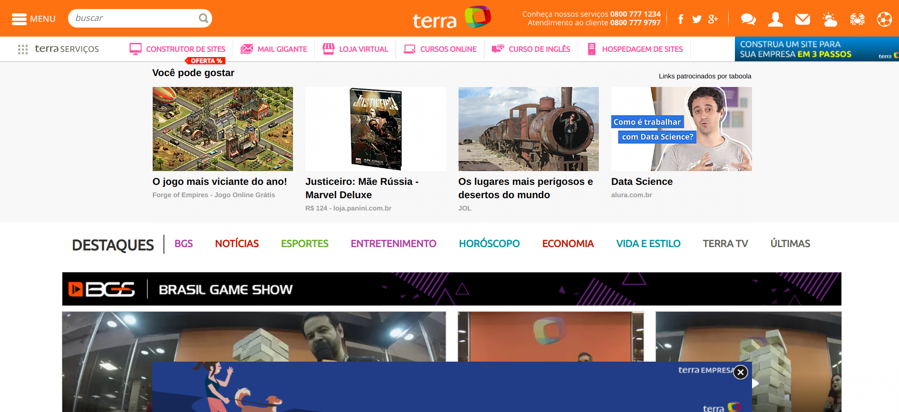
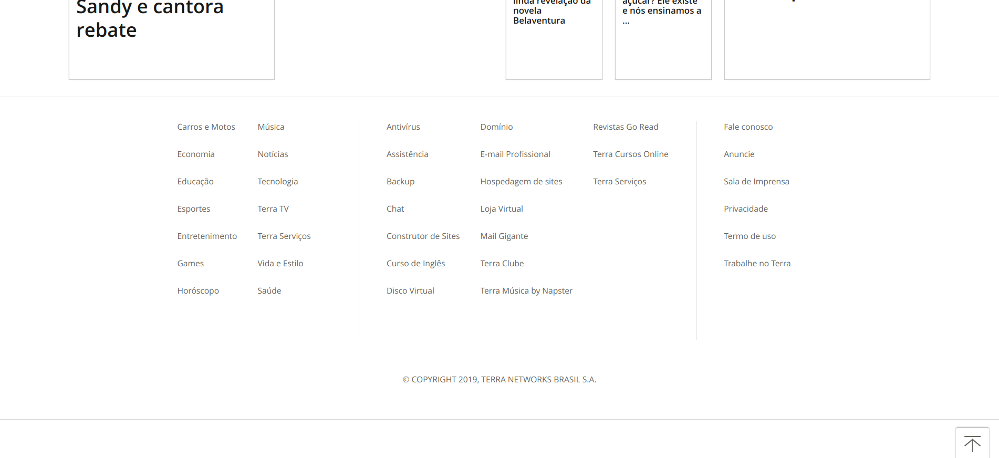
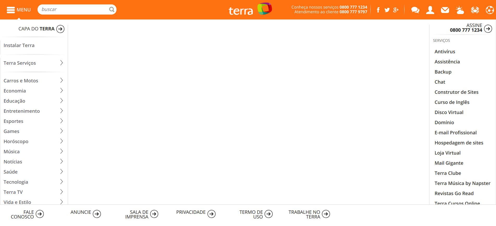
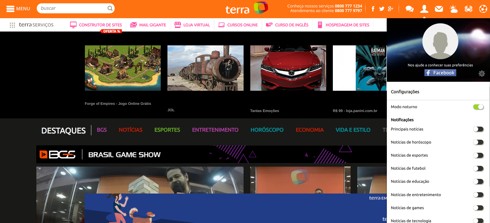
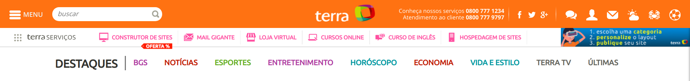
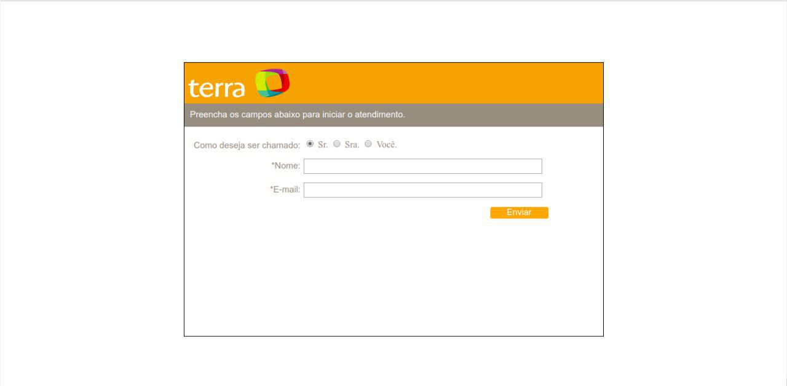
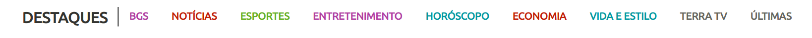
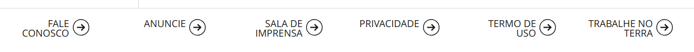
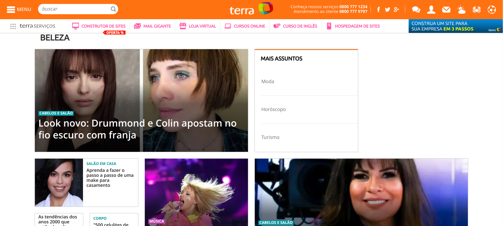

## **Guia de Estilo**

 &emsp;
É comum, principalmente em projetos grandes, reunir os princípios e as diretrizes adotados em um documento intitulado guia de estilo. Trata-se de um registro das principais decisões de design tomadas, de forma que elas não se percam, isto é, sejam efetivamente incorporadas no produto final. Guias de estilo servem de ferramenta de comunicação entre os membros da equipe de design e também com a equipe de desenvolvimento. É importante que as decisões de design possam ser facilmente consultadas e reutilizadas nas discussões sobre extensões ou versões futuras do produto.

Um guia de estilo deve incorporar decisões de design envolvendo os principais elementos e considerações de design de interface. Marcus (1992) considera os seguintes elementos:

<b>1.</b> Layout: proporção e grids; uso de metáforas espaciais; design gráfico de exibidores e ferramentas;

<b>2.</b> Tipografia e seu uso em diálogos, formulários e relatórios;

<b>3.</b> Simbolismo: clareza e consistência no design de ícones;
Cores: os dez mandamentos sobre o uso de cores;

<b>4.</b> Visualização de informação: design de gráficos, diagramas e mapas;
ƒDesign de telas e elementos de interface (widgets).

 &emsp;
Uma estrutura comum de guia de estilo é a seguinte (Marcus, 1992; Mayhew, 1999):

### **s1. Introdução**

#### **1.1. Objetivo do guia de estilo**

 &emsp;O objetivo é registrar as principais decisões de design tomadas, de forma que elas não se percam, isto é, sejam efetivamente incorporadas no produto final, no caso a elaboração de um protótipo.

#### **1.2. Organização e conteúdo do guia de estilo**

 &emsp;
Foi feita uma análise de um site já existente, manteremos muita coisa e reformulamos algumas dessas

#### **1.3. Público-alvo do guia de estilos (programadores, gerentes, equipe de suporte)**

 &emsp;
O público alvo é própria equipe que está propondo uma reformulação da aplicação para aplicar em um protótipo. 

#### **1.4. Como manter o guia**

 &emsp;A tarefa é aperfeiçoar e corrigir erros a fim de propor um protótipo de acordo com conceitos sobre interação humano computador. Sempre que novas notícias forem adicionadas, deverá seguir o guia. 

### **2. Resultados de análise** 
#### **2.1. Descrição do ambiente de trabalho do usuário**

 &emsp;
Em um primeiro momento, o usuário depara-se com as notícias principais, em alta, que ocorrem ou ocorreram no mundo, podendo escolher as mais diversas categorias de notícias através de um menu, podendo também ajustar as páginas para um modo noturno assim como solicitar alguma ajuda ou também compartilhar notícias. O Usuário também pode participar de chats.

 
### **3. Elementos de interface** 
#### **3.1. Disposição espacial e grid**

 &emsp;
A disposição espacial e grid são confusas, as janelas que contém  notícias se confundem com os anúncios oferecidos, conforme o usuário avança pelas páginas de cima para baixo, são oferecidas muitas notícias, até chegar me no fim da página. As janelas possuem um alinhamento, mas contém falhas.

<i>Home page, anúncios parecem que são notícias</i>

   

<i>FIm de uma página</i>

<i>Disposição espacial falha</i>

#### **3.2. Janelas**

 &emsp;
São inúmeras janelas, existem janelas para categorizar notícias, e a cada notícia são criadas mais janelas, existe um padrão a ser seguido, como por exemplo, a barra de navegação. Além disso existem janelas para um chat público assim como janelas no modo noturno.

<i>Modo noturno</i>

 
#### **3.3. Tipografia**

 &emsp;
Em relação a Tipografia, o site utiliza as seguintes fontes:

	

	
#### **3.4. Símbolos não tipográficos**

 &emsp;
Temos os seguintes Ícones para resumir certas ideias:

 &emsp;
Temos a esquerda, as redes sociais da página, do outro lado, opções de chat, opções de usuário, e-mail(não entra no escopo), informações sobre clima, horóscopo e futebol, respectivamente. Outro símbolo é este abaixo, que possibilita o usuário acessar um menu com outras informações sobre o site.

 

 
#### **3.5. Cores**

 &emsp;A logo pode ser encontrada de duas formas diferentes, o nome do site por extenso ou apenas sua logo. Aqui está a palheta de cores de ambas as logos:

 &emsp;
No percorrer do site encontramos as seguintes cores:

 
#### **3.6. Animações**
O site não possui.

### **4. Elementos de interação**
#### **4.1. Estilos de interação**

 &emsp; 
Dentre os estilos de interação mais comumente utilizados, encontramos as linguagens de comando, a linguagem natural e a interação por menus, por formulários, por manipulação direta e WIMP (Windows, Icons, Menus, and Pointers).

 &emsp;
O site mescla um pouco do estilo de interação por menus, por formulários e e WIMP, predominando a interação por menus, abaixo podemos ver.

<i>Interação por Menus, assim como por WIMP, no caso dos ícones</i>

 &emsp;Observação: Terra serviços não entrará no escopo

<i>Interação por formulários na parte de  solicitação de ajuda.</i>

 
#### **4.2. Seleção de um estilo**

 &emsp;
O site trabalha bem com um pouco do estilo de interação por menus, por formulários e e WIMP, predominando a interação por menus, como já citado. Na interação através de menus, o sistema oferece um conjunto de opções dentre as quais o usuário deve selecionar a que lhe interessa.

#### **4.3. Aceleradores (teclas de atalho)** 

 &emsp; Não possui.

### **5. Elementos de ação** 
#### **5.1. Preenchimento de campos** 

 &emsp;Para solicitar atendimento, campos devem ser preenchidos, não podendo avançar sem o preenchimento dos mesmos.

#### **5.2. Seleção**

 &emsp; Basta selecionar o campo de como o usuário gostaria de ser chamado, nome e e-mail. 

#### **5.3. Ativação** 
Depois, com apenas um clique em “enviar”, o usuário estará apto a conversar com algum funcionário da aplicação.

### **6. Vocabulário e padrões** 
#### **6.1. Terminologia** 

 &emsp; As terminologias principais que encontramos no portal de notícias estão logo abaixo em formato de imagens: 

#### **6.2. Tipos de tela (para tarefas comuns)**
 

 &emsp;Todas as páginas possuem como padrão uma barra de navegação única, os serviços são oferecidos, mas não entram no escopo do projeto.

	
                                 

<i>Navigation Bar</i>

 &emsp;A página a seguir retrata bem o uso da barra de navegação:

<i>Página referente a beleza</i>

 &emsp;
Mayhew (1999) sugere ainda que o guia de estilo inclua todos os produtos do levantamento de dados e análise das necessidades dos usuários, registrando o design rationale, ou seja, mantendo o rastreamento entre uma decisão de design e os elementos de discussão que culminaram naquela decisão.

 &emsp;
Quando elaboramos um guia de estilo, não basta simplesmente produzi-lo. Devemos comunicar adequadamente sua existência e importância para os demais designers e desenvolvedores, oferecer treinamento, facilitar o acesso ao documento como um todo ou a um tópico específico e investir em uma mudança na cultura de design 284 Interação Humano-Computador e desenvolvimento da equipe. Além disso, não devemos tratar o guia de estilo como um conjunto de regras, mas sim uma ferramenta prática de apoio ao trabalho e à criatividade. Em outras palavras, um guia de estilo deve ser utilizado como parte de um processo reflexivo de design, e não como um conjunto de soluções prontas ou fórmulas geradoras de soluções.

