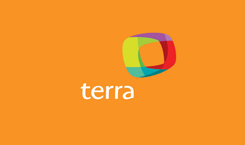
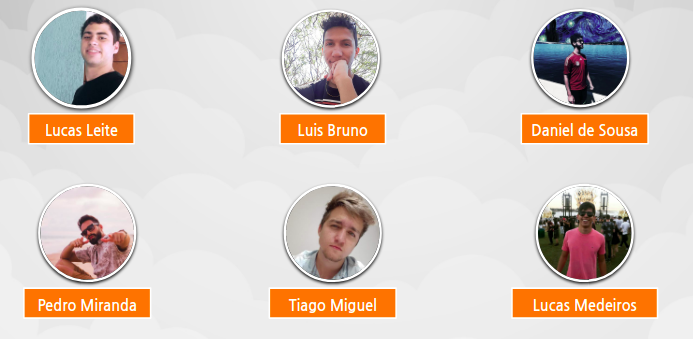

# Home

## **Sobre o Terra**

Terra é uma empresa brasileira de internet pertencente ao grupo espanhol Telefónica, um dos maiores conglomerados de telecomunicações fixas e móveis do mundo.

Lançado no Brasil após aquisição do até então portal gaúcho de conteúdo Zaz (ex-Nutecnet), o Terra foi escolhido pelo grupo Telefónica como parte da estratégia de iniciar suas operações de Internet na América Latina.

Além de atuar como portal de notícias, atualmente a companhia também trabalha com aplicativos de celular, publicidade e outros serviços digitais. Em agosto de 2017, o portal Terra passou a funcionar somente no Brasil, encerrando suas atividades em parte da América Latina, Espanha e EUA. O atual CEO da empresa é Javier Castro.

## **História do Terra**

Em 1988, Marcelo Lacerda e Sérgio Pretto criaram a Nutec Informática S/A, empresa de software voltada para automação de escritórios em ambiente Unix e, numa segunda fase, revendedora de softwares e integradora de sistemas.

Após anos de investimento no mercado de TI e na automação comercial, a Nutec decidiu investir na internet a partir do contato com universidades americanas. Para lidar com os investimentos na internet, em 1995 foi criada a Nutecnet, cujo primeiro produto foi um serviço de e-mail.

Em outubro de 1995, a Nutec entrou no mercado de internet e se tornou o provedor NutecNet. O advento da internet permitiu que a NutecNet ampliasse suas ações para o mercado de varejo. A empresa cresceu e foi adquirida pelo Grupo RBS em 1996. Em dezembro do mesmo ano, o canal ZAZ foi criado.

Em 20 de março de 1998, a marca ZAZ assimilou a marca NutecNet, tornando-se tanto ISP (Internet Service Provider) como ICP (Internet Content Provider). Com isso foi criado o Canal Interativo ZAZ, sendo este um dos primeiros canais de entretenimento e lazer no Brasil. Ainda assim, a marca NutecNet era mantida como ISP.

Em fevereiro de 2000, o ZAZ foi adquirido pelo grupo Telefonica, substituindo a marca para Terra. Em maio do mesmo ano, a Terra Networks e a Lycos Inc se uniram em um acordo, criando a Terra Lycos. Com isso, a empresa se tornou uma das redes mais populares da internet no mundo.Essa parceria se encerrou em 2004, quando a Daum Communications, um portal da Coreia do Sul, adquiriu a subsidiária norte-americana Lycos.

A Terra Networks possui escritórios nos principais mercados da América Latina: Buenos Aires (Argentina), Santiago (Chile), Bogotá (Colômbia), Cidade do México e Monterrey (México), Lima (Peru) e Miami (Estados Unidos). O Terra tem sua sede no Brasil, com escritórios em São Paulo e Porto Alegre. Em 2011, o Terra foi eleito pela primeira vez como uma das 100 melhores empresas para se trabalhar, segundo pesquisa do Instituto Great Place to Work.

Em 2010, a Terra passa a apoiar a Fundação Wikimedia. A empresa declarou: "Terra orgulhosamente apoia a Fundação Wikimedia. Você também pode ajudar produzindo e distribuindo conteúdo livre e disseminando conhecimento."

Em 28 de junho de 2017, a Terra anunciou através de sua assessoria de imprensa que o seu portal e serviço de e-mail seriam descontinuados nos Estados Unidos, Peru, México, Chile, Colômbia, Argentina, Venezuela e Equador a partir das 23h59 de 30 de junho. A empresa manteve serviços corporativos que fornecia em tais países, que passaram a ser oferecidos por operadoras locais do grupo Telefónica. A operação brasileira da companhia, por sua vez, foi adquirida pela Telefônica Data, uma subsidiária integral da Telefônica Brasil, pela cifra de R$ 250 milhões. A divisão da Terra no Brasil era responsável pela maior parte do lucro global da companhia, que passou a atuar apenas no país.

Em junho de 2018, o Terra fechou parceria com o Grupo Estado para aumentar a produção de conteúdo de notícias.

## **Sobre a Disciplina**

### **Engenharia de Software**

 A Engenharia de Software é um curso da engenharia focada para produção de software. Como em toda engenharia, os Engenheiros de Software devem adotar abordagens sistemáticas e organizadas e, levando em consideração as restrições e recursos disponíveis, visa desenvolver a melhor solução para o determinado problema.

### **Interação Humano Computador**

A comunicação é uma das muitas necessidades do ser humano, pois desde a época das cavernas ele demonstra o anseio por expressar o que passa dentro de si e no meio em que vive, tudo isso através de pinturas nas paredes das cavernas, rabiscos e formas geométricas. A necessidade de estar em sociedade e de comunicar caminham juntas dentro do ser humano e ele, desde sempre, buscou formas para que isso acontecesse.

O ser humano encontra-se em constante evolução e tudo quanto está dentro dele e ao seu redor acompanha esse ritmo, sejam seus desejos mais íntimos ou necessidades básicas, tudo se adapta, tudo se aprimora e se transforma, desde o Homem-de-neandertal.

A necessidade de comunicação acompanhou a evolução e aprimorou a forma com que o ser humano comunica e interage em seu meio e, muito mais do que isso, essa evolução fez com que ele conseguisse comunicar-se com quem quer que seja. Essa interação vem sendo aprimorada todos os dias e tem mudado a vida de todos nós, indireta e diretamente.

Esse anseio por interação/comunicação deu ao ser humano a capacidade de criar dispositivos (celulares, computadores, notebooks, etc) que são hoje como parte do seu corpo, ou seja, é quase impossível viver sem, dando origem ao termo IHC (Interação humano-computador). O IHC é o estudo da interação entre pessoas e computadores. É uma matéria interdisciplinar que relaciona a ciência da computação, artes, design, ergonomia, psicologia, sociologia, semiótica, linguística, e áreas afins. A interação entre humanos e máquinas acontece através da interface do utilizador, formada por software e hardware. Ela é utilizada, por exemplo, para algumas manipulações de periféricos de computadores e grandes máquinas como aviões e usinas hidrelétricas.

## **Integrantes**

## **Professor**

O professor responsável por ministrar a matéria de Interação Humano Computador no semestre 2019/2 é o André Barros.

## **Histórico de Revisões**

Data | Responsável | Versão | Alteração 
---- | ----------- | ------ | ---------
13/10/2019 | [@pedroMiranda7410](http://github.com/pedroMiranda7410) | 1.0 | Estilizado front-end do mkdocs |
14/10/2019 | [@pedroMiranda7410](http://github.com/pedroMiranda7410) | 2.0 | Acrescentando conteúdo Sobre o terra, História do Terra , Sobre a disciplina, Integrantes, professor |
14/10/2019 | [@dansousamelo](http://github.com/dansousamelo) | 2.1 | Ajustando caminho das imagens |

## **Referência**
* 
 Terra. Portal Terra e como tudo começou. Disponível em: http://tecnologia.terra.com.br/internet10anos/interna/0,,OI542329-EI5029,00.html. Acesso em: 15 out. 2019.

